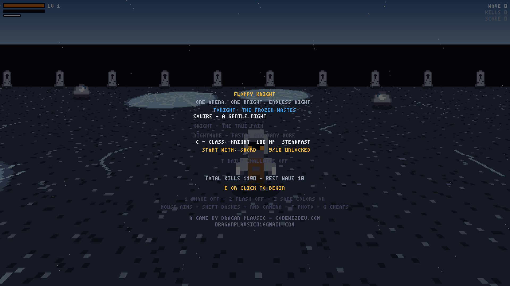
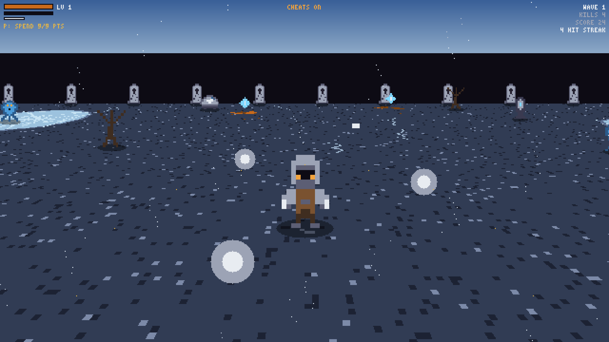
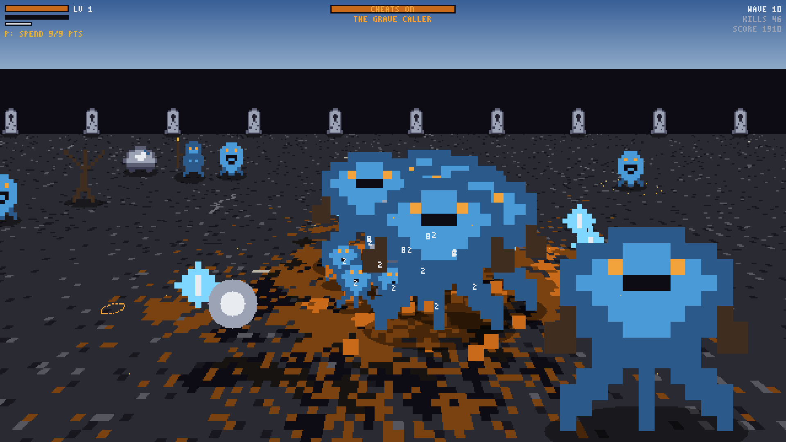
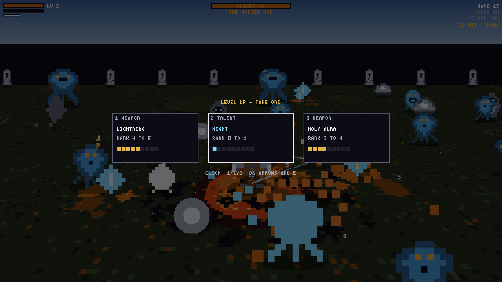
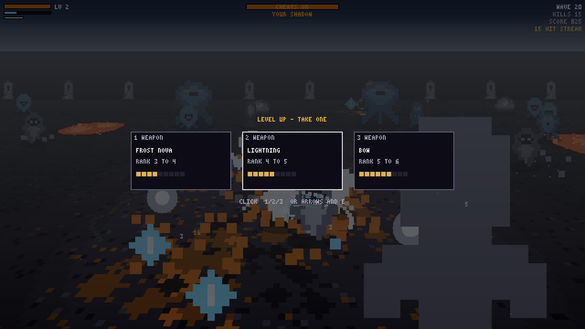

# FLOPPY KNIGHT

A wave-survival action RPG that fits on a 1.44MB floppy disk.

**A game by [Dragan Plavsic](https://codewizdev.com/) — draganplavsic01@gmail.com**

One arena. One knight. Endless night.

Entry for the [1.44MB Game Development Contest](https://2pgarcade.com/contest-144mb.html) by 2P GAME ARCADE.

## Download

| Platform | Release | Size |
|---|---|---|
| Windows (x86-64) | [windows-v1.0](https://github.com/codewizdevs/floppy-knight/releases/tag/windows-v1.0) | ~73 KB |
| Linux (x86-64) | [linux-v1.0](https://github.com/codewizdevs/floppy-knight/releases/tag/linux-v1.0) | ~44 KB |

Source code is **not published yet**. It will be released here after the contest ends.


## Screenshots



*Title — pick a difficulty, class, and starting weapon.*



*Wave 1 — torchlight, orbs, the first gems.*



*Wave 10 — The Grave Caller and a packed graveyard.*



*Wave 15 — The Molten One. Late waves used the in-game cheats (G) so the horde could be photographed.*



*Wave 20 — Your Shadow in the middle of the horde.*

## The game

You are a knight in a torchlit arena, and the dead will not stop coming. Survive one wave and a bigger one follows. Level up, draft new powers mid-fight, and see how deep into the night you can go.

- Ten weapons that evolve when you max a matched pair
- Four procedurally built biomes, unique bosses, elites, shrines, weather, and a day/night cycle
- Daily challenge with a ghost of your best run
- LAN co-op across Windows and Linux
- Everything — graphics, music, the arena — is generated by the executable. No engine, no assets, no audio samples. Inspired by [.kkrieger](https://en.wikipedia.org/wiki/.kkrieger).

## Controls

- **WASD** — move
- **Mouse** — aim; **hold left click** to fire
- **Hold right click and drag** — orbit and tilt the camera (cursor hides while you steer)
- **Scroll wheel** — zoom in and out
- **Shift** — dash
- **P / Esc** — pause menu (Esc only quits from the title screen or after death)
- **C** (title) — swap Knight / Ranger
- **T** (title) — daily challenge
- **G** (title, solo) — cheats for reviewing later waves (cheated runs are not recorded)

### Windows SmartScreen

The exe is unsigned. The first launch may warn you — click **More info**, then **Run anyway**. It only asks once. Progress saves to `%APPDATA%\floppyknight.sav`.

### Linux

```sh
chmod +x floppyknight_linux
./floppyknight_linux
```

Needs a desktop and a sound card. Nothing else.

### LAN co-op

```sh
floppyknight_windows.exe --host              # player 1
floppyknight_windows.exe --join 192.168.1.5  # player 2, host's LAN IP
```

UDP port 47777. Windows and Linux can play together.

## Source

This repository holds the public releases only. Full source will be published after the 1.44MB contest judging is over (deadline 4 September 2026).
